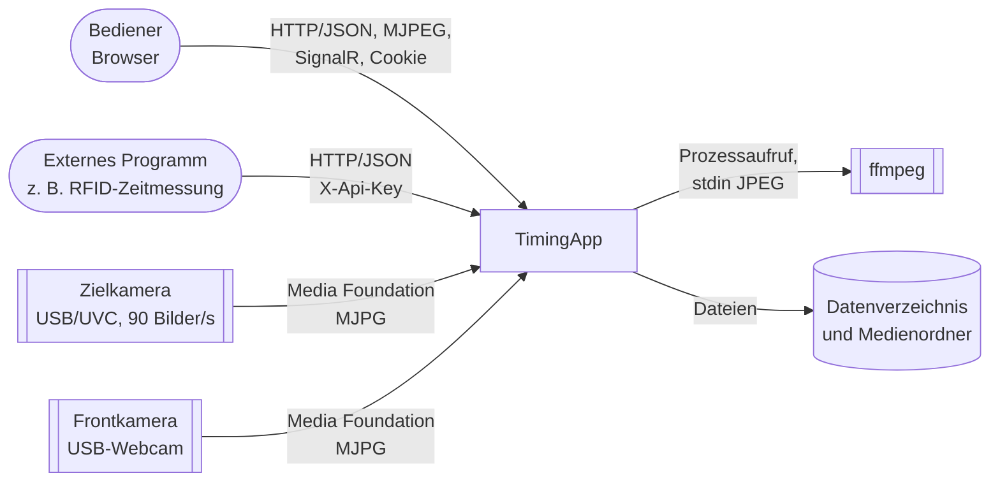

# 3 Kontextabgrenzung

| Nachbar | Schnittstelle | Implementierung |
|---|---|---|
| Bediener (Browser) | REST unter `/api/*`, Live-Push über SignalR `/hubs/finish`, MJPEG unter `/api/live/{kind}`, Medien mit HTTP-Range unter `/api/recordings/{id}/files/{file}` | `TimingApp.Api` |
| Externes Programm | REST unter `/api/control/*` mit Header `X-Api-Key` ([ADR-001](../requirements/adr/ADR-001-external-control-api-key.md)) | `ControlEndpoints`, `ApiKeyAuthenticationHandler` |
| Zielkamera, Frontkamera | Media Foundation Source Reader über Vortice.MediaFoundation, natives Format explizit (MJPG); Rückfall OpenCV `VideoCapture` (DSHOW, V4L2) | `MediaFoundationCameraSource`, `UsbCameraSource` |
| ffmpeg | Externer Prozess, Pfad konfigurierbar (`TimingApp:Camera:FfmpegPath`) | `FfmpegVideoEncoder` |
| Dateisystem | Datenverzeichnis `TimingApp:Storage:DataDirectory`, Medienordner einstellbar | `FileRecordingStore`, `JsonSettingsStore` |

Der API-Vertrag ist `openapi/openapi.json`; die Frontend-Typen werden daraus erzeugt (`scripts\generate-api.ps1`).
