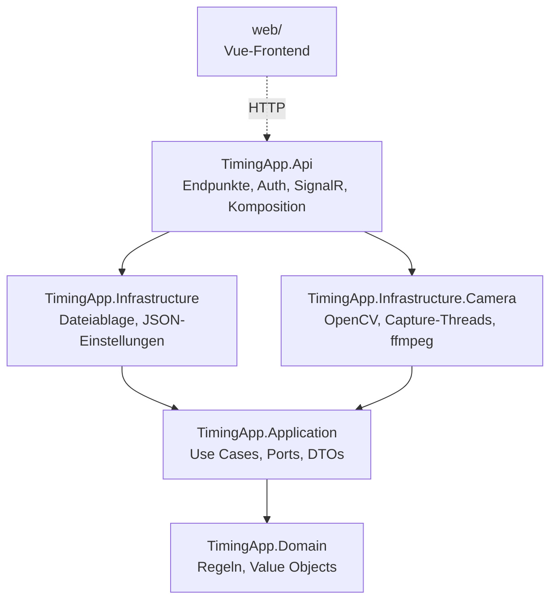

# 5 Bausteinsicht

## Ebene 1: Projekte

Die Abhängigkeiten zeigen nach innen. `TimingApp.Architecture.Tests` prüft: Domain nur BCL; Application ohne
ASP.NET Core, OpenCV und Infrastruktur; Infrastrukturprojekte kennen sich nicht gegenseitig; OpenCvSharp nur in
`TimingApp.Infrastructure.Camera`; Domain- und Application-Typen gehören zu `FinishRecording` oder `SharedKernel`.

Es gibt einen Bounded Context: `FinishRecording`. `CameraDetection` und die übrigen Kontexte aus CLAUDE.md §9
existieren noch nicht.

## Ebene 2: Bausteine

### Domain (`TimingApp.Domain.FinishRecording`)

| Baustein | Aufgabe |
|---|---|
| `FinishRecordingSettings`, `CameraSettings`, `FinishLineSettings`, `DetectionSettings` | Einstellungen als Value Objects mit Validierung und stabilen Fehlercodes `settings.*`; Standardwerte aus FS1-26 |
| `FinishLineMonitor` | Lernt den Hintergrund, misst die Belegung, passt den Hintergrund an, solange die Linie frei ist |
| `FinishEventTracker` | Zustandsautomat der Zielereignisse (Beginn, Nachlauf, maximale Dauer, Stopp) |
| `RecordingWindow` | Zeitfenster der Aufnahme (Vorlauf) und des Frontvideos (Front-Vor- und Nachlauf) |
| `LineRateMeter`, `LineRate` | Gemessene Linienrate und Warnregel (unter 95 %) |
| `RecordingId` | Kennung und Verzeichnisname einer Aufnahme, streng validiert |

### Application (`TimingApp.Application.FinishRecording`)

| Baustein | Aufgabe |
|---|---|
| `FinishRecordingService` | Betriebszustände und Befehle, serialisiert; erzeugt je Kamerastart eine `CaptureSession` |
| `CaptureSession` (intern) | Eine Verarbeitungsschleife je Sitzung: Belegung, Zielereignisse, Spaltenpuffer, Linienrate |
| `RecordingSaver` | Speicher-Queue: Frontbilder abwarten, Zielbild rendern, Videos erzeugen, Metadaten zuletzt schreiben |
| `SettingsService`, `RecordingService` | Einstellungen, Aufnahmeliste, Dateien, Löschen |
| `TimeRange` | Auswahl von Spalten/Frontbildern, die ein Zeitfenster vollständig abdeckt |

Ports (von der Infrastruktur implementiert):

| Port | Implementierung |
|---|---|
| `ICameraSystem`, `ICameraSession`, `IFrontFrameBuffer` | `CameraSystem`, `CameraSession`, `FrontFrameBuffer` |
| `ILivePreview` | `CameraSystem` |
| `IFinishImageRenderer` | `FinishImageRenderer` |
| `IVideoEncoder` | `FfmpegVideoEncoder` |
| `IRecordingStore` | `FileRecordingStore` |
| `ISettingsStore` | `JsonSettingsStore` |
| `IMediaDirectoryResolver` | `MediaDirectoryResolver` |
| `IFinishRecordingNotifier` | `LiveStatusPublisher` (Api, SignalR) |

### Infrastructure.Camera

| Baustein | Aufgabe |
|---|---|
| `ICameraSource`, `ICameraSourceFactory` | Interner Hardware-Port der Capture-Threads (arbeitet mit OpenCV `Mat`) |
| `MediaFoundationCameraSource` | Standard unter Windows: liest die Kamera über den Media Foundation Source Reader (Vortice.MediaFoundation), wählt das native Format explizit (konfiguriertes `FourCc` = MJPG, sonst YUY2/NV12) in der eingestellten Größe mit höchster Bildrate, dekodiert mit OpenCV; setzt die Belichtung über `IAMCameraControl` und liest sie zurück (`camera.exposureNotApplied` als Warnung) |
| `UsbCameraSource` | Rückfall über OpenCV `VideoCapture` (DirectShow, V4L2): Auflösung, Bildrate, FourCC, Belichtung |
| `ICameraDeviceEnumerator` | Videogeräte mit Name, Gerätepfad und Aufnahmemodi in der Index-Reihenfolge des Capture-Backends; ohne Modi für die Auflösung beim Start (`includeModes: false`) |
| `MediaFoundationDevices` | Enumeration über `MFEnumDeviceSources` (Vortice.MediaFoundation; Backend `Auto`/`Msmf` unter Windows), in der Index-Reihenfolge von `MediaFoundationCameraSource`; Modi aus den nativen Media Types, für eine nicht aktivierbare Kamera die zuletzt gelesenen. Die Geräte werden dabei nicht geöffnet. |
| `DirectShowDevices` | Enumeration der DirectShow-Kategorie Video Input (nur Backend `DShow`) |
| `DirectShowModes` | Aufnahmemodi je Gerät (Größe, höchste Bildrate, Pixelformat) aus `IAMStreamConfig` des Capture-Pins; bevorzugt das konfigurierte `FourCc` |
| `DeviceResolution`, `MissingCameraSource` | Sucht beim Start den Index der per Name gewählten Kamera (Pfad, sonst eindeutiger Name); nicht gefunden → Quelle, deren `Open` mit `camera.notFound` scheitert |
| `SyntheticCameraSource`, `VideoFileCameraSource`, `SimulationControl` | Simulation über denselben Port |
| `CameraWorker` | Capture-Thread je Kamera, Zeitstempel, gemessene Bildrate, Fehlerzustand |
| `CaptureClock` | Gemeinsame monotone Zeitbasis aller Kameras |
| `LineExtractor` | Entnimmt die Ziellinie als Spalte des gedrehten Bildes (`ImageRotation`), gemittelt über die Breite; liest dafür die passende Zeile/Spalte des Rohbilds, ohne es zu drehen. Dreht nur Vorschaubilder (`Upright`) |
| `FramePreview`, `LiveStrip`, `PreviewWatchers` | Live-Vorschau, nur kodiert, solange jemand zusieht |
| `ColumnImage`, `FinishImageRenderer` | Zielbild mit Zeitleiste als PNG |
| `FfmpegVideoEncoder` | Ziel- und Frontvideo über ffmpeg |

### Api

| Baustein | Aufgabe |
|---|---|
| `AuthEndpoints` | PIN-Anmeldung per Cookie ([ADR-002](../requirements/adr/ADR-002-operator-pin-login.md)) |
| `ControlEndpoints` | Steuerbefehle für Bediener und externe Programme; Beenden nur extern |
| `RecordingEndpoints`, `SettingsEndpoints`, `LiveEndpoints` | Aufnahmen, Dateien, Einstellungen, Geräte, MJPEG, Simulator |
| `ApiKeyAuthenticationHandler`, `AccessPolicies` | `X-Api-Key`-Schema und Policies `control`, `external` |
| `FinishHub`, `LiveStatusPublisher` | Status-Push und Hinweis auf geänderte Aufnahmeliste |
| `FinishRecordingLifecycle` | Startzustand (FS1-04) und geordnetes Beenden |

### Frontend (`web/src/features`)

| Feature | Inhalt |
|---|---|
| `access` | `LoginView`, `sessionStore` |
| `finishRecording` | `LiveView`, `LivePreview`, `ModeBadge`, `RecordingsView`, `PlaybackView`, `FinishImageViewer`, `SettingsView`, Stores `controlStore`, `recordingsStore`, Logik `playbackSync` |

Gemeinsam: `api/client.ts` (typisierter Client und `mediaUrls`), `api/live.ts` (SignalR mit Polling-Fallback),
`i18n/messages/*` (de, en), `shared/format.ts` (Uhrzeit abgeschnitten nach FS1-70).
