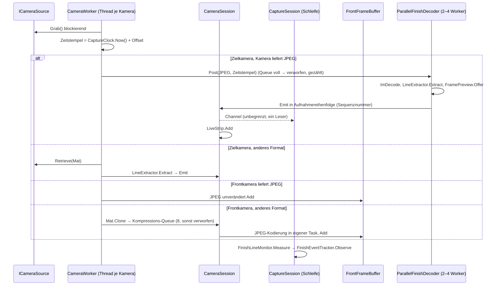

# 6 Laufzeitsicht

## Capture-Pipeline

Der Capture-Thread schreibt keine Dateien, kodiert keine Videos und nimmt keine Sperren, die Start und Stopp
halten. Er entpackt nur, wenn eine Senke das Bild braucht (`CapturedFrame.Decode`); Kamera-JPEGs der Zielkamera
entpackt der `ParallelFinishDecoder`, die der Frontkamera werden nicht entpackt. Die Mat-Instanz eines Threads
gehört dem Thread und wird bei seinem Ende freigegeben. Beim Stoppen arbeitet der Decoder seine Queue ab, bevor
der Column-Channel abgeschlossen wird.

## Zielereignis und Speichern

1. Die Belegung erreicht den Schwellwert (oder der manuelle Auslöser ist aktiv): Zielereignis beginnt.
2. Die Linie bleibt für den Nachlauf frei, die maximale Dauer ist erreicht, oder die Kameras werden gestoppt:
   Zielereignis endet.
3. Bestand während des Ereignisses der Zustand Aufnahme, übergibt `CaptureSession` einen `RecordingDraft`
   (Spalten im `RecordingWindow`, Zugriff auf `IFrontFrameBuffer`, Einstellungs-Snapshot) an `RecordingSaver`.
4. `RecordingSaver` wartet, bis Frontbilder bis zum Ende des Front-Nachlaufs vorliegen (höchstens Nachlauf + 3 s
   oder bis die Sitzung endet), legt das Verzeichnis an, rendert `finish.png`, erzeugt `finish.mp4` und
   `front.mp4` und schreibt zuletzt `recording.json`. Erst dann erscheint die Aufnahme in der Liste.
5. Scheitert ein Video, bleiben Zielbild und Zeitstempel erhalten; der Fehlercode steht in den Metadaten und als
   `LastProblem` im Status.

## Passagen der Zeitmessung (FEATURE-SET-2)

1. `POST /api/passages` → `FinishRecordingService.ReportPassage`: nur im Zustand Aufnahme, Startnummer geprüft,
   Versatz addiert; die Passage kommt in eine nebenläufige Queue der `CaptureSession` (Antwort 202).
2. Die Verarbeitungsschleife ordnet sie mit der nächsten Spalte zu, in dieser Reihenfolge:
   laufendes, zu speicherndes Zielereignis (Passagezeit ab Ereignisbeginn − Vorlauf) → kürzlich gespeicherte
   Aufnahme, deren Fenster die Passagezeit enthält → wartende Aufnahme um andere Passagen → neue Aufnahme um die
   Passagezeit (Vorlauf bis Nachlauf, Ende `Passage`). Beginnt ein Zielereignis, übernimmt es wartende Passagen, die
   in seinem Fenster liegen.
3. Eine Aufnahme um Passagen wird gespeichert, sobald Spalten bis zu ihrem Ende vorliegen (oder die Kameras
   stoppen). Ist die Aufnahme schon gespeichert, schreibt der Saver die Passagen über `UpdatePassagesAsync` nach.
4. Liegt eine Passage mehr als 5 s zurück und sind ihre Spalten nicht mehr gepuffert, wird sie protokolliert und
   verworfen.

## Stoppen und Beenden

- `StopAsync`: Die Kamerasitzung wird freigegeben (Threads beendet, Column-Channel abgeschlossen); die
  Verarbeitungsschleife liest die restlichen Spalten und schließt ein laufendes Ereignis ab (FS1-03).
- `POST /api/control/shutdown` (nur API-Key): antwortet `202`, danach `StopApplication`;
  `FinishRecordingLifecycle.StopAsync` ruft `ShutdownAsync` = Stoppen + Warten auf alle Speichervorgänge. Ein
  weiterer Stopp nach dem Entsorgen der Dienste ist wirkungslos. `HostOptions.ShutdownTimeout` ist
  `TimingApp:FinishRecording:ShutdownTimeout` (Standard 10 min).
- Ein neuer Kamerastart wartet, bis die vorherige Sitzung ihre Geräte freigegeben hat (`CameraSession.Released`).

## Start

`TimingApp:FinishRecording:StartupMode` (`Stopped`, `Preview`, `Recording`) startet die Kameras, sobald der Server
läuft (FS1-04), z. B. `TimingApp.Api.exe --TimingApp:FinishRecording:StartupMode=Recording`.

## Live-Status

`LiveStatusPublisher` sendet `status` bei Änderungen (gebündelt, 100 ms) und alle 500 ms, solange Kameras laufen
oder gespeichert wird; `recordingsChanged` nach Speichern oder Löschen. Ohne Verbindung fragt der Client per
Polling ab.
