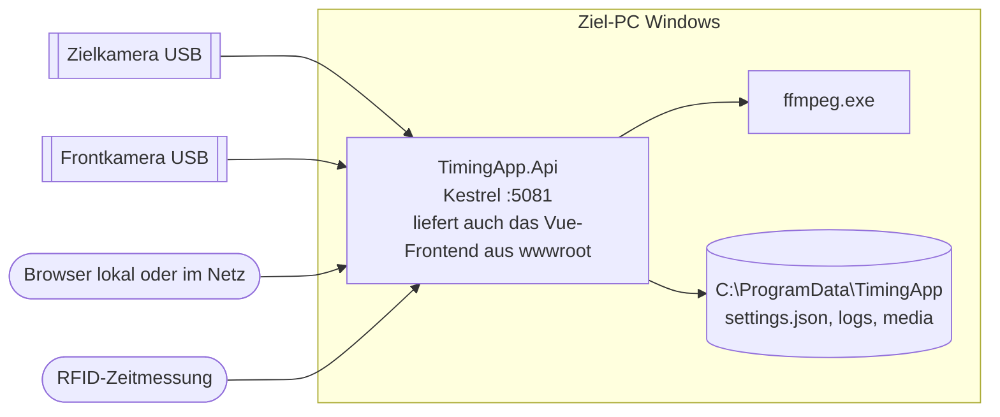

# 7 Verteilungssicht

| Element | Konfiguration |
|---|---|
| HTTP-Endpunkt | `Kestrel:Endpoints:Http:Url`, Standard `http://0.0.0.0:5081` (nie 5080) |
| Datenverzeichnis | `TimingApp:Storage:DataDirectory`, Standard `C:\ProgramData\TimingApp`; Entwicklung `src\TimingApp.Api\data` |
| Medienordner | Einstellung in der Oberfläche; Standard `<DataDirectory>\media` |
| Bediener-PIN | `TimingApp:Access:OperatorPin` (außerhalb des Repositorys setzen) |
| API-Key externer Programme | `TimingApp:ExternalControl:ApiKey` (leer = abgeschaltet) |
| ffmpeg | `TimingApp:Camera:FfmpegPath`, Standard `ffmpeg` aus `PATH`; Version ≥ 5.1 mit libx264 |
| Capture-Backend, Pixelformat | `TimingApp:Camera:Backend` (`Auto`/`Msmf` = Media Foundation direkt unter Windows, `DShow` = OpenCV/DirectShow, `V4L2`), `TimingApp:Camera:FourCc` (`MJPG`) |
| Simulation | `TimingApp:Camera:Simulation:Enabled`, optional `FinishVideoFile`, `FrontVideoFile`, `FrontCameraMissing`, `FinishCameraMissing` |
| Startzustand | `TimingApp:FinishRecording:StartupMode` |

Entwicklung: `dotnet run --launch-profile http` (Development: Simulation an, PIN `0000`, API-Key `dev-key`) und
`npm run dev` im Ordner `web` (Port 5173, Proxy auf 5081). Playwright startet das Backend auf 5082 mit eigenem
temporärem Datenverzeichnis.
